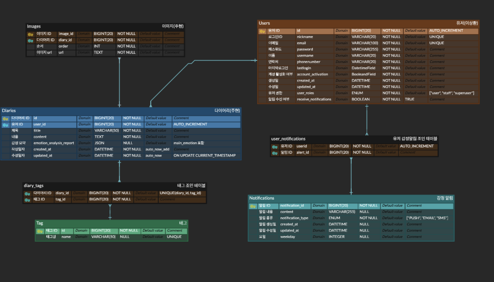

# FastAPI Diary Project

## 📌 프로젝트 소개

**Diary API**는 FastAPI 기반의 감정 분석 일기 서비스예요.

Google **Gemini 2.5-flash**로 일기 본문을 분석해 `main_emotion`과 상세 리포트를 저장하고,

**부정 감정 일기 누적 10건 이상**이면 사용자 선호 채널(PUSH/EMAIL)로 **알림**을 발송합니다.

## ✨ 주요 기능

- **회원 관리**: 회원가입 / 로그인 / 로그아웃
- **인증**: JWT 기반 인증
- **일기 관리**: CRUD (생성, 조회, 수정, 삭제), 이미지 업로드
- **검색 & 정렬**: 일기 내용 검색, 날짜/감정별 정렬
- **감정 분석**: 감정 분석(Gemini (2.5-flash) API로 일기 본문을 비동기 감정 분석)
- **감정 알림 발송**: 부정 감정 일기 누적 10건 이상이면 사용자 선호 채널(PUSH/EMAIL)로 알림 1회 발송

---

## 🛠 기술 스택

- **Backend**: FastAPI, Pydantic
- **AI**: Google Gemini 2.5-flash (API 키 기반 연동)
- **ORM**: Tortoise ORM
- **Database**: PostgreSQL
- **DevOps**: Docker, Docker Compose, Aerich (DB 마이그레이션)
- **Security**: JWT 인증

---

## 📂 프로젝트 구조

```plaintext
app/
 ├── ai/
 │   ├── api.py
 │   ├── prompts.py
 │   ├── schema.py
 │   ├── service.py
 │   ├── test_gemini.py
 │   └── __init__.py
 ├── diary/
 │   ├── api.py
 │   ├── service.py
 │   ├── repository.py
 │   ├── schema.py
 │   ├── model.py
 │   ├── test_diary.py
 │   └── __init__.py
 ├── user/
 │   ├── api.py
 │   ├── service.py
 │   ├── repository.py
 │   ├── schema.py
 │   ├── model.py
 │   ├── auth.py
 │   ├── test_user.py
 │   └── __init__.py
 ├── tag/
 │   ├── api.py
 │   ├── service.py
 │   ├── repository.py
 │   ├── schema.py
 │   ├── model.py
 │   ├── test_tag.py
 │   └── __init__.py
 ├── notification/
 │   ├── api.py
 │   ├── service.py
 │   ├── repository.py
 │   ├── schema.py
 │   ├── model.py
 │   ├── seed.py
 │   ├── test_notification.py
 │   └── __init__.py
 ├── db/
 └── main.py
```

---

## 🗄 ERD



---

## 🚀 실행 방법

### Docker Compose 환경

```shell
# Docker Compose 빌드 (캐시 무시)
docker compose build --no-cache web

# Docker Compose 실행
docker compose up

```

---

## 간단한 다이어리 FE

- 내장 테스트 페이지: **http://localhost:8000/tools/diary-tester.html**
  1. 로그인으로 `access_token` 발급
  2. 브라우저 콘솔에서 `localStorage.setItem("access_token", "<토큰>")`
  3. 페이지에서 제목/내용/태그/이미지로 생성 → 자동 감정 분석 반영
  4. 통계·알림 동작 확인

---
