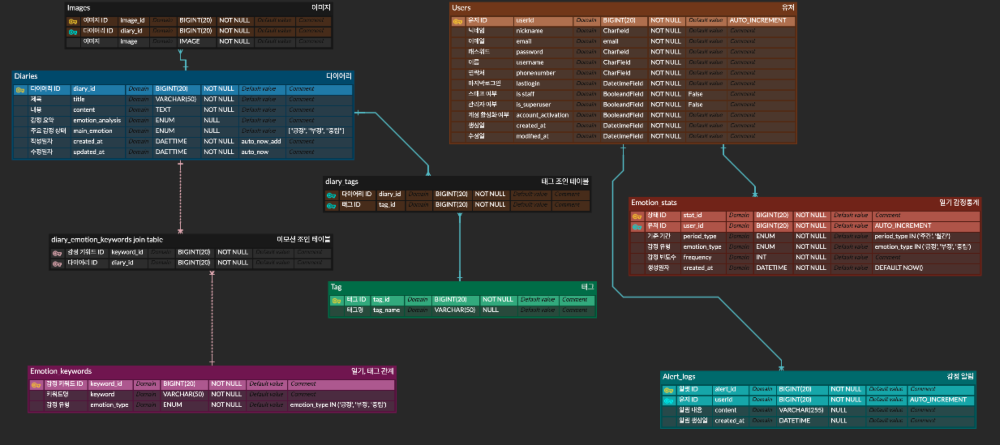

# FastAPI Diary Project

## 📌 프로젝트 소개

FastAPI 기반의 일기 관리 웹 서비스

## ✨ 주요 기능

- **회원 관리**: 회원가입 / 로그인 / 로그아웃
- **인증**: JWT 기반 인증
- **일기 관리**: CRUD (생성, 조회, 수정, 삭제)
- **검색 & 정렬**: 일기 내용 검색, 날짜/감정별 정렬
- **감정 분석**: 작성된 일기의 감정 분석 기능

---

## 🛠 기술 스택

- **Backend**: FastAPI, Pydantic
- **Database**: PostgreSQL
- **DevOps**: Docker, Aerich (DB 마이그레이션)
- **Security**: JWT 인증

---

## 📂 프로젝트 구조

```plaintext
app/
 ├── diary/
 │   ├── api.py
 │   ├── service.py
 │   ├── repository.py
 │   ├── schema.py
 │   ├── model.py
 │   ├── test_diary.py
 │   └── __init__.py
 ├── user/
 │   ├── api.py
 │   ├── service.py
 │   ├── repository.py
 │   ├── schema.py
 │   ├── model.py
 │   ├── test_user.py
 │   └── __init__.py
 ├── tag/
 │   ├── api.py
 │   ├── service.py
 │   ├── repository.py
 │   ├── schema.py
 │   ├── model.py
 │   ├── test_tag.py
 │   └── __init__.py
 ├── core/              # 공통
 ├── db/
 └── main.py
```

---

## 🗄 ERD



---

## 🚀 실행 방법

### Docker Compose 환경

```shell
# Docker Compose 빌드 (캐시 무시)
docker compose build --no-cache web

# Docker Compose 실행
docker compose up

```
